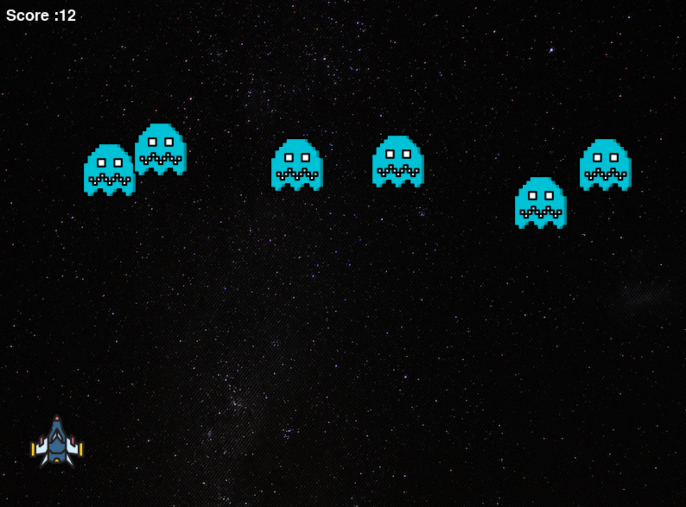
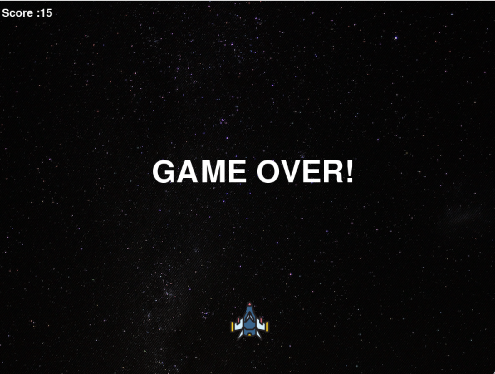

# Alien-Attack

You are a <strong>Warrior</strong> stranded in the emptiness of space and there comes the aliens trying to kill you, your objective is to try surviving the aliens as long as you can, these aliens will not stop coming for you... so your option is only to <STRONG>SURVIVE</STRONG>

The more <STRONG>ALIENS</STRONG> you hit the more you <STRONG>SCORE!</STRONG>

To move your `space-craft` press the `left` and `right` arrow keys and to shoot press your `spacebar`


To play this game follow the steps given below

- Clone the repository to your local system, use the below command

```
git clone https://github.com/Blake2912/Alien-Attack.git
```

- Create your virtual environment
- Activate the virtual environment

Refer the virtual environment guide <a href="https://packaging.python.org/en/latest/guides/installing-using-pip-and-virtual-environments/#creating-a-virtual-environment">here!</a>

- Copy and paste the following command to install dependencies

```
pip install -r requirements.txt
```

- Run the following to launch the game

```
python3 main.py
```
# Gameplay Images
<br>
<center></img></center>
<br>
<br>
<center></img></center>

# Credits

- This project was done using the <a href="https://github.com/pygame/pygame">pyGame</a> module.
  
